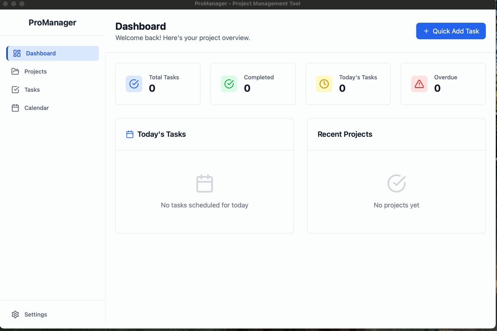

# ProManager GIF Recording Guide

This guide helps you create professional animated GIFs to showcase ProManager's features.

## 📱 Demo Scenarios to Record

### 0. **Main Demo** (ProManagerDemo.gif) - PRIMARY
**Duration:** 25-30 seconds
**Actions:**
- Start from dashboard (show stats and today's tasks)
- Navigate to Projects page
- Create a new project quickly
- Navigate to project detail or tasks
- Create a new task with priority and due date
- Change task status (To Do → In Progress → Done)
- Return to dashboard to show updated statistics
- Smooth transitions between all sections

*This is the main demo GIF that showcases the complete application flow.*

### 1. **Dashboard Overview** (dashboard-overview.gif)
**Duration:** 8-10 seconds
**Actions:**
- Show the main dashboard with stats cards
- Highlight today's tasks section
- Show recent activity
- Demonstrate quick navigation

### 2. **Project Management** (project-management.gif)
**Duration:** 12-15 seconds
**Actions:**
- Navigate to Projects page
- Create a new project (click "New Project" button)
- Fill in project details (name, description, color)
- Save and show the project in the list
- Click on project to show tasks

### 3. **Task Creation & Management** (task-management.gif)
**Duration:** 15-20 seconds
**Actions:**
- Navigate to Tasks page or Project detail page
- Click "Add Task" button
- Fill in task details:
  - Title: "Design new user interface"
  - Description: "Create wireframes and mockups"
  - Priority: "High"
  - Due date: Select a date
- Save task
- Show task in list with status indicators
- Change task status (drag or click to change from "To Do" to "In Progress")

### 4. **Task Filtering & Organization** (task-filtering.gif)
**Duration:** 10-12 seconds
**Actions:**
- Show tasks page with multiple tasks
- Use priority filter (All → High → Medium → Low)
- Use status filter (All → To Do → In Progress → Done)
- Show results changing in real-time

### 5. **Complete Task Workflow** (complete-workflow.gif)
**Duration:** 20-25 seconds
**Actions:**
- Start from Dashboard
- Navigate to Projects
- Open a project
- Create a new task within the project
- Set task priority and due date
- Mark task as complete
- Return to dashboard to show updated stats

## 🎬 Recording Best Practices

### Before Recording:
1. **Prepare test data** - Have some projects and tasks ready
2. **Clean up** - Clear browser console, hide unnecessary UI elements
3. **Set up screen** - Use consistent window size (1200x800 recommended)
4. **Plan actions** - Practice the sequence a few times

### During Recording:
1. **Move slowly** - Deliberate mouse movements, pause between actions
2. **Show feedback** - Let animations complete, show loading states
3. **Keep it focused** - Stay within the app, avoid external distractions
4. **Consistent timing** - 1-2 second pause between major actions

### After Recording:
1. **Review quality** - Check for smooth playback
2. **Optimize file size** - Use the provided script for compression
3. **Test on different devices** - Ensure GIF displays well

## 🛠 Recording Tools Setup

### Option 1: LICEcap (Recommended for simplicity)
```bash
# Already installed via: brew install --cask licecap
open -a LICEcap
```

### Option 2: macOS Built-in + ffmpeg (More control)
1. **Record**: Press `Cmd+Shift+5`, select area, click Record
2. **Convert**: Use our script `./scripts/create-gif.sh recording.mov demo-name`

### Option 3: Alternative tools
```bash
# Install other options
brew install --cask kap          # Modern screen recorder
brew install --cask gifcapture   # Simple GIF recorder
```

## 📏 Technical Specifications

- **Resolution**: Max 1000px width (auto height)
- **Frame Rate**: 15 FPS for smooth animation
- **Duration**: 5-25 seconds per GIF
- **File Size**: Target under 3MB per GIF
- **Format**: Optimized GIF with dithering
- **Colors**: Optimized palette for smaller file size

## 🎯 GIF Naming Convention

```
assets/
├── ProManagerDemo.gif         # Main comprehensive demo (PRIMARY)
├── dashboard-overview.gif     # Feature-specific demos
├── project-management.gif
├── task-management.gif
├── task-filtering.gif
└── complete-workflow.gif
```

## 📊 Example Usage in README

```markdown
## 🎥 Live Demo



*Complete overview of ProManager's key features: project creation, task management, status tracking, and dashboard insights.*

## 🎥 Features Demo

### Dashboard Overview


### Project Management


### Task Management

```

## 🚀 Quick Start

1. **Start the app**: `pnpm tauri dev`
2. **Choose recording method**: LICEcap or built-in screen recording
3. **Follow demo scenarios** above
4. **Convert to optimized GIF**: `./scripts/create-gif.sh recording.mov demo-name`
5. **Add to README**: Update with GIF references

---

**💡 Pro Tip**: Record multiple takes and choose the best one. Small file sizes and smooth animations are key for good documentation GIFs!
